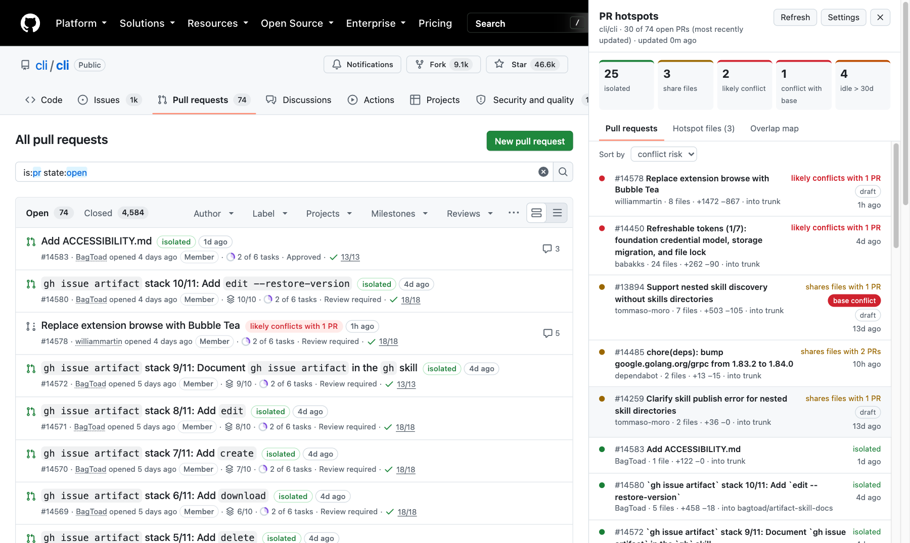

# PR Hotspots

A Chrome extension that shows, on GitHub, which open pull requests touch the same files, which ones are isolated, which ones will likely conflict with each other, and when each one was last active.



## What it shows

**On the pull request list (`/owner/repo/pulls`)**, each PR title gets badges:

- `isolated` (green): no other open PR into the same base branch touches its files.
- `shares files with N PRs` (yellow): other PRs edit the same files, but in different parts of each file.
- `likely conflicts with N PRs` (red): other PRs edit the same or adjacent lines.
- `conflicts with base` (solid red): GitHub reports a merge conflict with the base branch right now.
- `3d ago`: time since the last activity. The badge turns orange after the stale threshold (30 days by default).

Hover over the badges for the list of overlapping PRs. Click them to open the sidebar at that PR.

**On every repository page**, a button in the bottom-right corner opens the hotspot sidebar. On a PR page, the button shows the status of that PR.

The sidebar docks to the right edge of the window. The GitHub page shrinks to make room, so the sidebar never covers the PRs. Drag the left edge of the sidebar to resize it. The extension remembers the width. Press <kbd>Esc</kbd> or click ✕ to close it.

The sidebar has three tabs:

1. **Pull requests**: all analyzed PRs, sorted by conflict risk, last activity, or number. Expand a row to see each overlapping PR and the shared files. A ⚠ marks the files with overlapping changes.
2. **Hotspot files**: files touched by two or more open PRs, sorted by the number of PRs.
3. **Overlap map**: a PR × PR grid. A yellow cell means shared files. A red cell means overlapping changes. A darker cell means more overlap. Click a cell to list the shared files of that pair.

## How "likely conflicts" works

GitHub reports whether a PR conflicts with its base branch. It does not report whether two open PRs conflict with each other, so the extension estimates it:

1. The background worker fetches the open PRs (GraphQL API) and the patch of each PR (`GET /repos/{owner}/{repo}/pulls/{n}/files`).
2. It reduces every patch to the lines of the base file that the PR changes.
3. Two PRs "likely conflict" when they change the same or adjacent lines of a file. Git uses the same rule for a textual conflict.

These cases always count as a conflict:

- Both PRs add the same path.
- One PR deletes a file that the other PR changes.
- GitHub omits the patch (binary files or very large diffs).

The result is an estimate. Each PR's line numbers are relative to its own merge base, so the ranges drift when PRs branch from different commits. On 9 pairs of overlapping open PRs in `cli/cli`, the prediction matched `git merge-tree` for all 9 pairs. In one pair, git found a conflict in a second file that the estimate missed.

PRs into different base branches never overlap, because they never merge into the same tree. A stack of PRs where each PR targets the previous branch therefore shows as isolated.

## Install

The extension is not on the Chrome Web Store. Load it from source:

1. Clone this repository:
   ```sh
   git clone https://github.com/H3xept/gh-hotspots.git
   ```
2. Open `chrome://extensions` and turn on **Developer mode**.
3. Click **Load unpacked** and select the cloned `gh-hotspots` directory.
4. Click the extension icon in the toolbar to open the settings. Pin the icon from the puzzle-piece menu if you do not see it.
5. Paste a GitHub token and click **Save**.

### GitHub token

The extension needs a token to read pull requests and their diffs. Use one of these:

- **Fine-grained token** (recommended): create one at <https://github.com/settings/personal-access-tokens/new>. Give it read-only **Pull requests** and **Contents** access to the repositories you want to inspect.
- **Classic token**: create one at <https://github.com/settings/tokens/new> with the `repo` scope. The `public_repo` scope is enough for public repositories.

Some organizations block fine-grained tokens or require approval for them. In that case, use a classic token.

The token stays in the extension's local storage. The extension sends it only to `api.github.com`.

## Settings

- **Open PRs to analyze per repository** (default 100): the most recently updated PRs come first.
- **Stale after N days** (default 30): the activity badge turns orange after this period.

## API usage and caching

- One GraphQL request per 50 open PRs, plus one REST request per 100 changed files of each new or changed PR.
- The worker caches the changed-line ranges of each PR by head commit SHA. A refresh re-fetches only the PRs with new commits.
- A full report stays cached for 5 minutes. The **Refresh** button in the sidebar forces a new report.
- The list page and PR pages load the report automatically. Other repository pages load it only when you open the sidebar.

## Troubleshooting

- **"GitHub rejected the token" or "Add a GitHub token"**: the token is missing, has expired, or was pasted wrong. Click **Settings** in the sidebar and save the token again.
- **"Repository not found"**: the token has no access to the repository. For a fine-grained token, add the repository under **Repository access**.
- **No badges on the list, but the bottom-right button appears**: GitHub probably changed the markup of the PR list. The sidebar still works. Please open an issue.

## Development

There is no build step. The extension is plain JavaScript (Manifest V3).

```sh
bun test
```

The tests cover `src/analysis.js`, the pure module that parses patches and compares PRs. After you change a file, click the reload arrow on the extension card in `chrome://extensions`, then reload the GitHub tab.

| File | Role |
| --- | --- |
| `src/analysis.js` | Patch parsing, line-range collisions, per-PR status, hotspot files |
| `src/github.js` | GitHub API requests and error mapping |
| `src/background.js` | Service worker: report building, caching, messages |
| `src/content.js` | Badges on the PR list and the docked sidebar |
| `src/content.css` | Badge styles (the sidebar styles live in its shadow root) |
| `src/options.html`, `src/options.js` | Token and settings page |

## License

[MIT](LICENSE)
